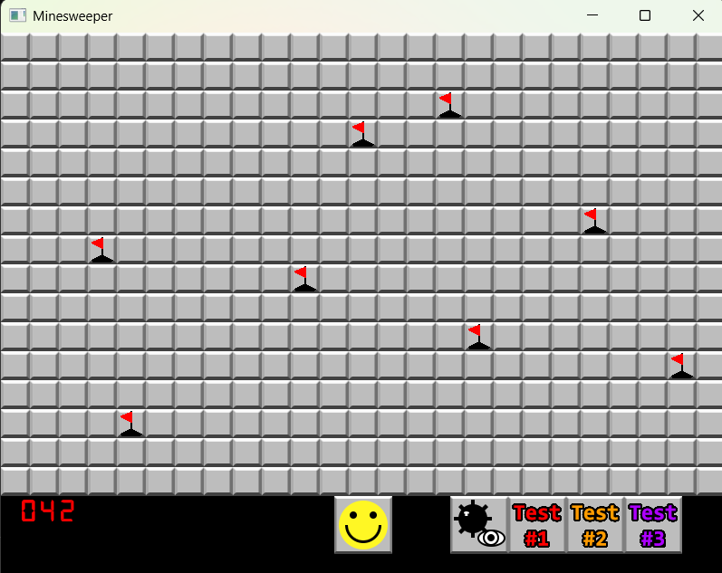
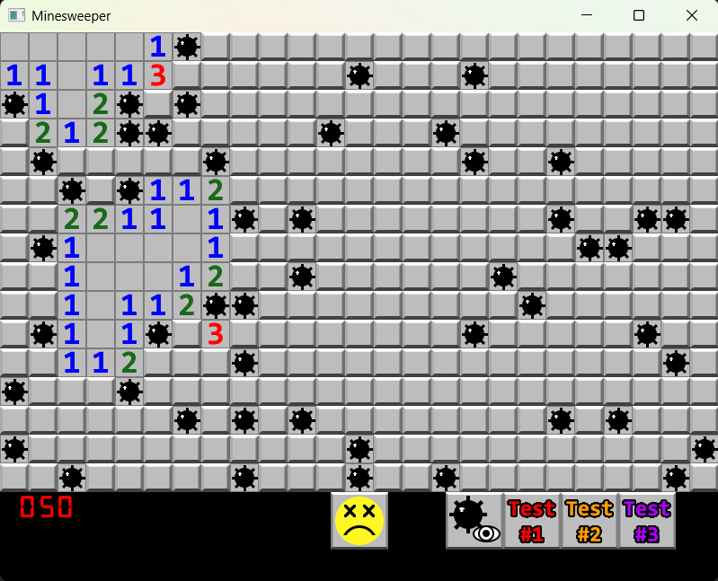

# Minesweeper
A minesweeper game built using C++ to combine all of the concepts covered in Programming Fundamentals II

## Features
- Load any size board from config.cfg, by simply typing rows, columns, and number of mines
- Random mine logic
- Recursive reveal logic
- Win/lose conditions
- Flag tile logic
- Flagged tiles vs mines on board counter (which can go negative)
- 3 implemented testboards
- A debug feature which reveals all the mines on the board
- A reset feature which will reset the game entirely if won or lost

## Why I built this
Final project for Programming Fundamentals II, focusing on object-oriented design, file I/O, and 2D graphics using an external library (SFML)

## How to run
- In the config.cfg file, type the amount of rows on the first line, the amount of columns on the second, and the number of mines on the third (it is initialized to 25, 16, and 50), or load one of the testboards by clicking the testboard button
- Play minesweeper!
- When the game is won or lost, the emoji at the bottom of the board will change, and you click it to reset the game
- You can also click one of the testboards to reset the game and load that specific board

## Technologies used
- Visual Studio
- C++
- SFML 2.5.1

## Screenshots

